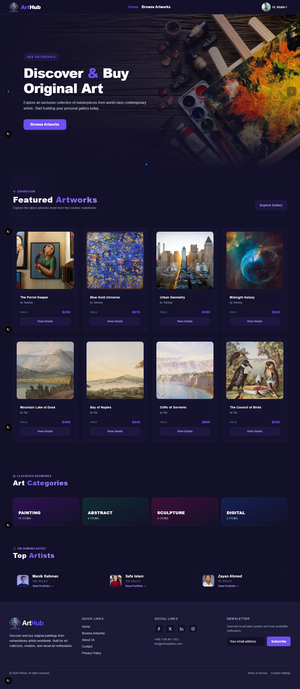
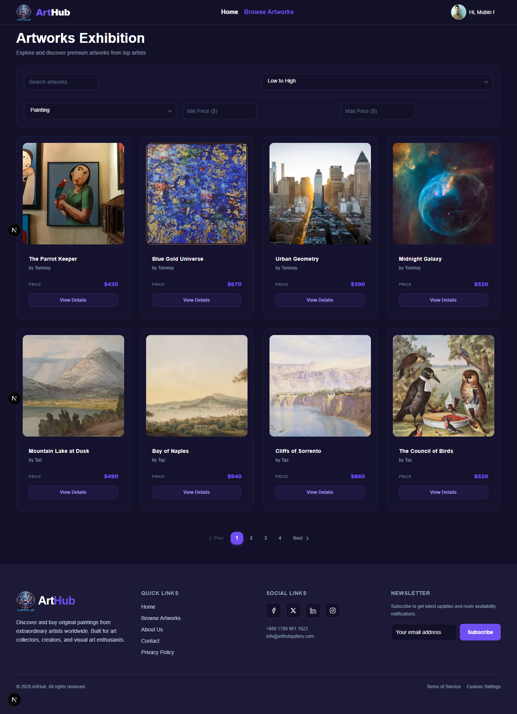
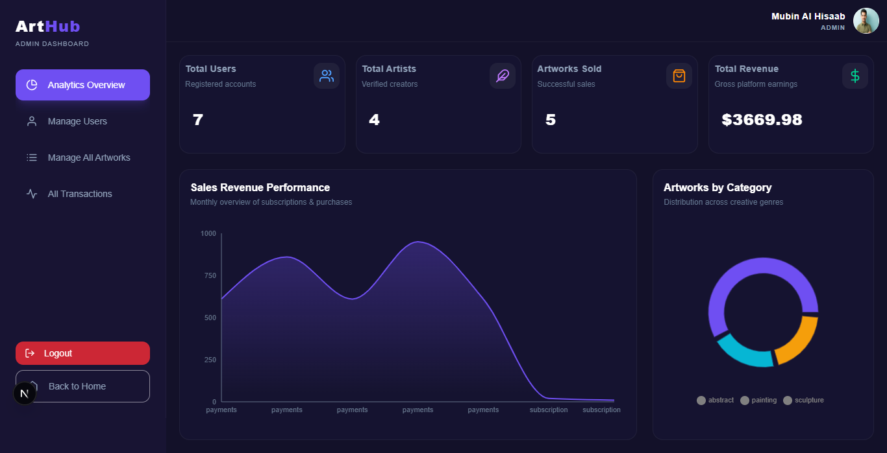
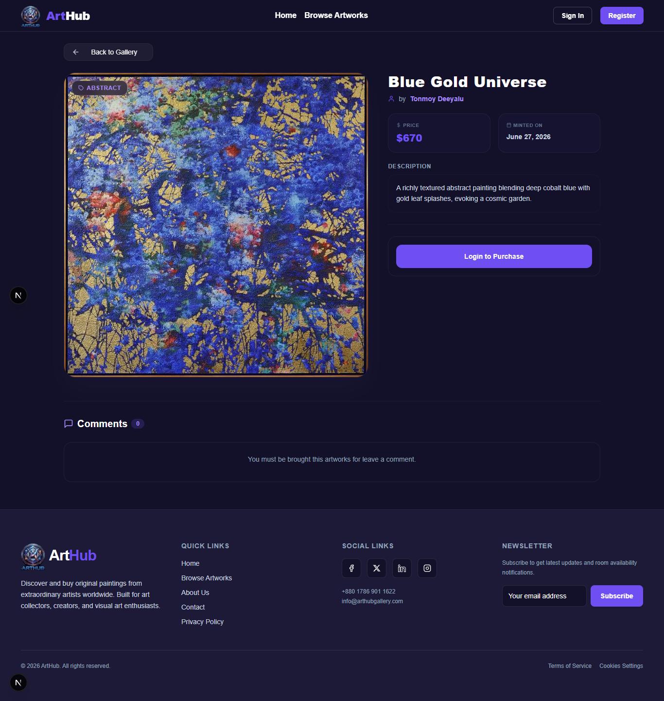

# ArtHub – Online Art Marketplace

A modern, full-stack MERN marketplace where artists showcase their artwork and collectors purchase authentic creations securely through Stripe.

---

## Project Overview

ArtHub is a role-based online art marketplace built with the MERN stack. It enables artists to publish and manage artwork while allowing buyers to discover, purchase, and review original art pieces. The platform includes secure authentication, Stripe payment integration, subscription plans, analytics dashboards, and role-based access control.

This project demonstrates production-level full-stack development practices including authentication, authorization, CRUD operations, payment processing, protected routes, dashboards, responsive UI, and REST API architecture.

---

# Live Website

## 🌐 Live Site

https://arthub-gallery.vercel.app

---

## Project Screenshots

<p align="center">
    
    
</p>

<p align="center">
    
    
</p>

---

# Key Features

## Authentication

- Email & Password Authentication
- Google Authentication
- JWT Authorization
- Protected Routes
- Role-Based Access Control
- Persistent Login
- Secure Logout

---

## Artwork Marketplace

- Browse All Artworks
- Featured Artworks
- Artwork Categories
- Search by Title
- Search by Artist
- Filter by Category
- Filter by Price Range
- Sorting
- Pagination
- Responsive Grid Layout

---

## Artwork Details

- High Resolution Artwork Image
- Complete Artwork Information
- Artist Profile Link
- Purchase Button
- Comment System
- Edit/Delete Artwork (Artist Only)
- Sold Badge
- Automatic Unpublish

---

## User Dashboard

- Purchase History
- Bought Artworks Gallery
- Profile Management
- Subscription Overview
- Upgrade Subscription
- Comment Management

---

## Artist Dashboard

- Add Artwork
- Edit Artwork
- Delete Artwork
- Manage Own Artworks
- Sales History
- Profile Management

---

## Admin Dashboard

- Manage Users
- Change User Roles
- Manage All Artworks
- View Transactions
- Analytics Dashboard
- Revenue Overview
- Sales Chart
- Category Pie Chart

---

## Stripe Payment

- Secure Checkout
- Artwork Purchase
- Subscription Payment
- Purchase History
- Transaction Records

---

## Extra Features

- Loading Skeleton
- Global Loading Spinner
- Error Boundary
- Custom 404 Page
- Responsive Design
- Toast Notifications
- Image Upload via imgBB

---

# 🛠 Tech Stack

## Frontend

- Next.js 16
- JavaScript ES6+
- Tailwind CSS
- HeroUI
- Framer Motion
- React Icons
- Sonner

---

## Backend

- Node.js
- Express.js
- MongoDB
- JWT
- Stripe API
- Better Auth
- CORS
- Dotenv

---

## Authentication

- Better Auth
- Google OAuth
- JWT

---

## Database

- MongoDB Atlas

---

## Deployment

- Vercel (Frontend & Backend)

---

# ⚙️ Installation Guide

## Clone Repository

```bash
git clone https://github.com/yourusername/arthub-client.git
```

```bash
git clone https://github.com/yourusername/arthub-server.git
```

---

## Client Setup

```bash
cd arthub-client
```

```bash
npm install
```

Create a `.env.local`

```env
NEXT_PUBLIC_API_URL=

NEXT_PUBLIC_FIREBASE_API_KEY=

NEXT_PUBLIC_FIREBASE_AUTH_DOMAIN=

NEXT_PUBLIC_FIREBASE_PROJECT_ID=

NEXT_PUBLIC_FIREBASE_STORAGE_BUCKET=

NEXT_PUBLIC_FIREBASE_MESSAGING_SENDER_ID=

NEXT_PUBLIC_FIREBASE_APP_ID=

NEXT_PUBLIC_IMGBB_KEY=

NEXT_PUBLIC_STRIPE_PUBLISHABLE_KEY=
```

Run

```bash
npm run dev
```

---

## Server Setup

```bash
cd arthub-server
```

```bash
npm install
```

Create `.env`

```env
PORT=

MONGODB_URI=

BETTER_AUTH_SECRET=

CLIENT_URL=

```

Run

```bash
npm run dev
```

---

# Environment Variables

The project uses environment variables to secure:

- MongoDB Credentials
- JWT Secret
- Better Auth Credentials
- Stripe Secret Key
- Stripe Publishable Key
- imgBB API Key

No secret keys are committed to GitHub.

---

# Database Collections

```
users

artworks

transactions

subscriptions


```

---

# User Roles

### 👤 Buyer

- Browse Artwork
- Purchase Artwork
- Manage Profile
- Upgrade Subscription

---

### Artist

- Upload Artwork
- Edit Artwork
- Delete Artwork
- View Sales History

---

### Admin

- Manage Users
- Manage Artworks
- View Transactions
- Analytics Dashboard

---

# 📦 NPM Packages

### Frontend

```
next

react

javascript ES6+

tailwindcss

hero-ui

framer-motion

react-icons

sonner

better auth
```

### Backend

```
express

mongodb

jsonwebtoken

stripe

cors

dotenv

better auth

cookie-parser
```
